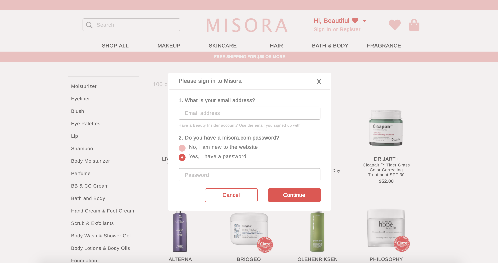
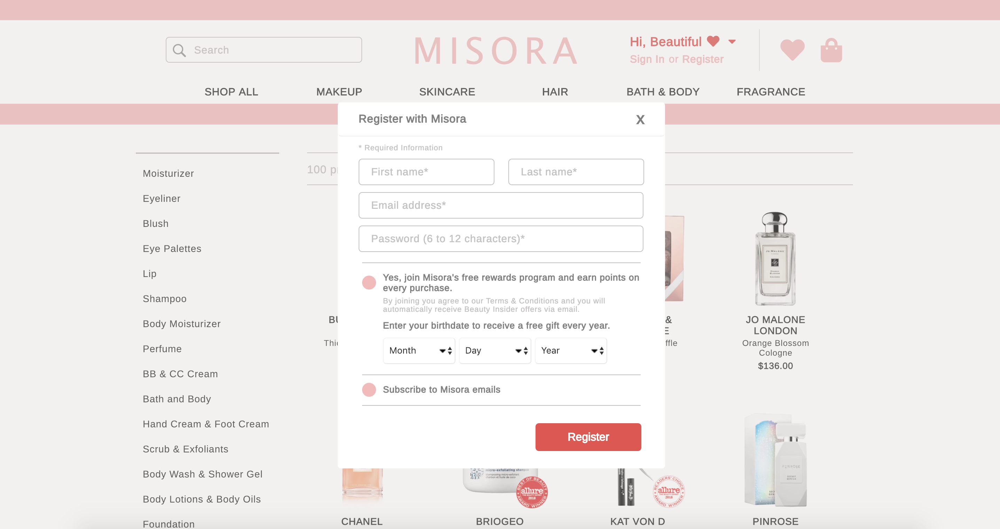
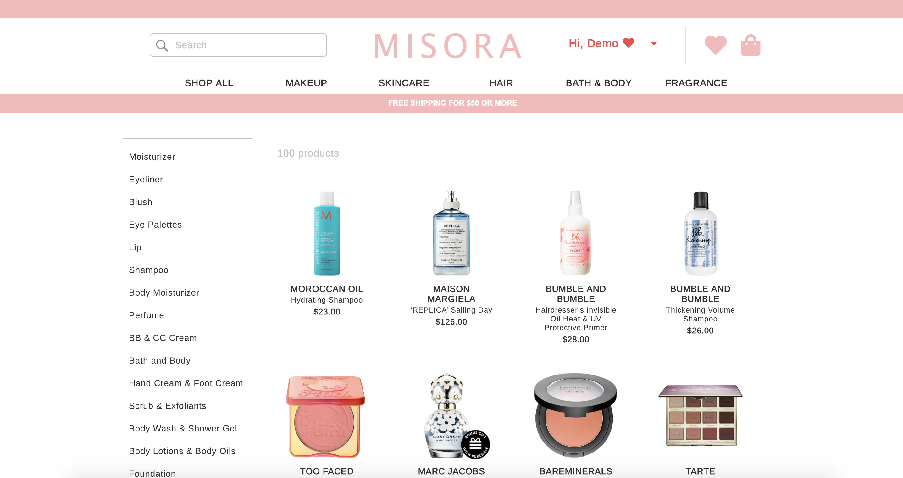
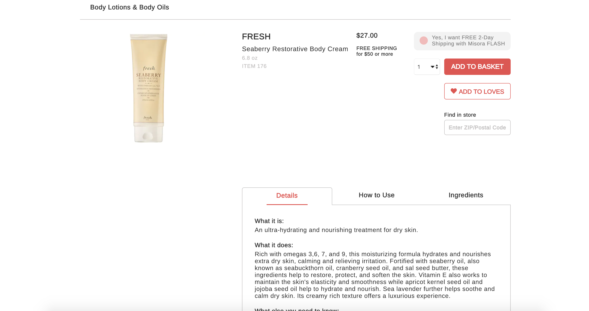
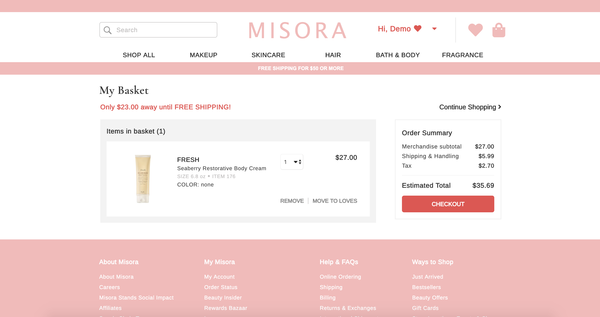
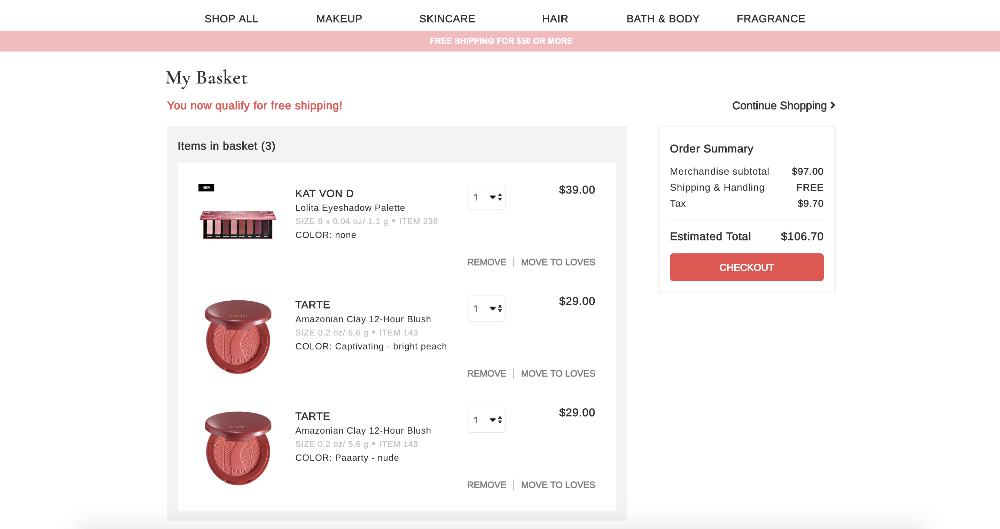
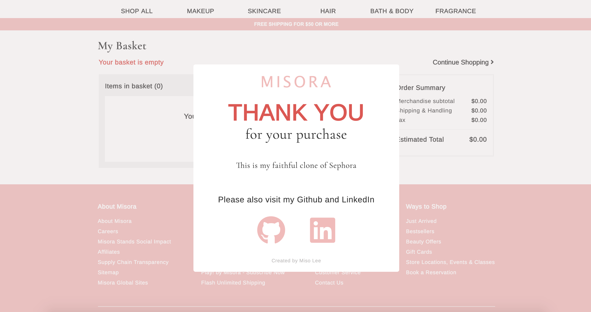

# Overview

Misora is a cosmetic webstore inspired by Sephora.

Live Site [here](http://misora.herokuapp.com/#/)!

#

## Technologies used

* Ruby on Rails
* PostgreSQL
* React
* Redux

#

## Functionality

### Sign In/Sign Up

User able to Sign In / Sign Up through a popup modal.

### Product Index

### Product Details

### Basket

User can add/edit the quantity/remove product to(from) the basket.

### Checkout

With a click of a button, user can checkout his/her items from the basket.

## Extra Features

* Free shipping for $50 or more
* User can't add more than 10 quantities for a single item.
* User can choose different colors where applicable.
* Filter by categories.